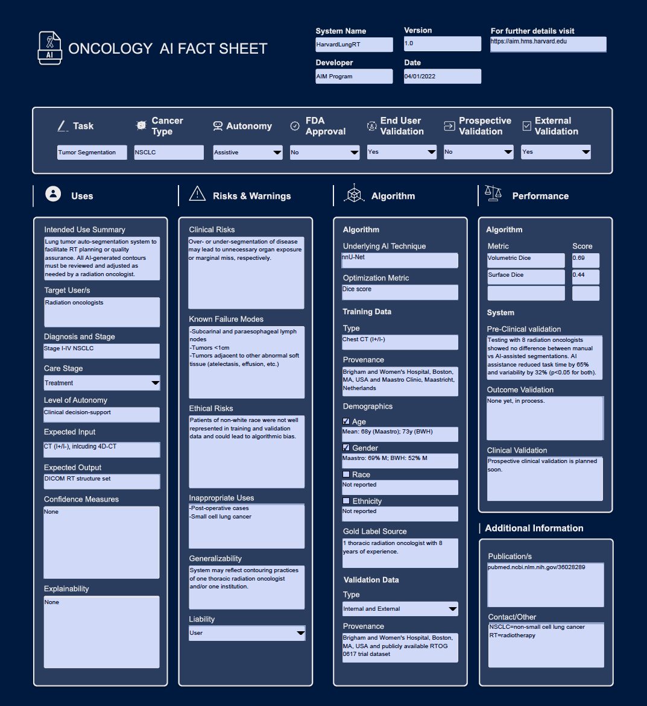

# **Oncology AI Fact Sheet**

Artificial intelligence (AI) systems—which consist of an AI algorithm and the contexts in which they are deployed, are increasingly obtaining FDA approval and entering the oncology clinic. To facilitate clinical translation of these AI systems, we created an easily digestible fact sheet specifically for **oncology end-users**. The fact sheet places primary focus on guiding end-user interaction and safe use of the system. Fact sheets are intended to be presented at deployment time or, in cases of automated deployment, at prediction time. 

We have made a user-friendly, fillable template publicly available [here](Onc_AI_FactSheet_Template.pdf). Below, we provide instructions and examples for each field of the Fact Sheet. In addition, brief instructions are also included when you hover over fields in the template pdf.

A note on style: This is not intended to be, nor can be, an exhaustive description of each AI system. Instead, developers should consider the most important information for the **clinical end-user** to understand before using the system. The text should be written in non-technical language wherever possible. There are opportunities to link out to additional information that provides more comprehensive information. 

Our publication describing the fact sheet is available [here](https://jamanetwork.com/journals/jamaoncology/article-abstract/2802831).
  
## Citation
Bitterman DS, Kamal A, and Mak RH. An Oncology Artificial Intelligence Fact Sheet for Cancer Clinicians. JAMA Oncol. Published online March 23, 2023. doi:10.1001/jamaoncol.2023.0012 

  
## Fully Completed Example
Oncology AI Fact Sheet for the lung tumor auto-segmentation system reported in [Hosny et al. *Lancet Digital Health* 2020](https://pubmed.ncbi.nlm.nih.gov/36028289/).

  
## Header

**System Name:** Name of the AI system. Data type: Text.
- Example: *Harvard LungRT*

**Version:** Version of AI system. Data type: Number.
- Example: *1.0*

**Developer:** Organization or individual who developed the system. Data type: Text.
- Example: *AIM Program*

**Date:** Date of most recent system update. Data type: Date
- Example: *04/01/2022*

**For further details visit:** Link to website with additional information on AI system. Data type: Text.
- Example: *https://aim.hms.harvard.edu*
  
## At-A-Glance Facts

**Task:** The clinical task that the AI system accomplishes or assists with. Data type: Text.
- Example: *Tumor Segmentation*

**Cancer Type:** The type of cancer that the system is intended to be used with. Data type: Text.
- Example: *Lung Cancer*
- Example: *Agnostic*

**Autonomy:** The level of autonomy with which the systen is intended to be used. Data type: Drop-down list (Assistive, Autonomous).

**FDA Approval:** Is the system FDA approved? Data type: Drop-down list (Yes, No).

**Prospective Validation:** Is prospective validation of the AI system completed? Data type: Drop-down list (Yes, No). 

**External Validation:** Is external validation of the AI system completed? Data type: Drop-down list (Yes, No). 
  
## Uses and directions

**Intended Use Summary:** A brief narrative description of the inded use of the system. This should be a 1-2 sentence summary of when, how, and why the system is intended to be used. Note that the reported information thorughout the Fact Sheets should describe the system under this same intended use. Data type: Text.
- Example: *Lung tumor auto-segmentation system to facilitate RT planning or quality assurance. All AI-generated contours must be reviewed and adjusted as needed by a radiation oncologist.*

**Target User/s:** The role group of the intended end-user/s. More than one end-user may be specificied. Data type: Text.
- Example: *Radiation oncologists*
- Example: *Nursing*
- Example: *Social workers and physicians*

**Diagnosis and Stage:** The cancer diagnosis and stage of cancer that the system is intended to be used with. Data type: Text.
- Example: *Lung Cancer, Stage I-IV*
- Example: *Breast Cancer, Stage I*
- Example: *Disease agnostic, Stage IV*

**Level of Autonomy:** The level of autonomy with which the system is intended to be used. This should be a finer-grained description than Assistive versus Autonomous. Please refer to [Bitterman et al. *Lancet Digital Health* 2020](https://pubmed.ncbi.nlm.nih.gov/33328110/) for more details and possible options. Data type: Text.
- Example: *Data presentation*
- Example: *Clinican decision-support*
- Example: *Conditional automation*
- Example: *High automation*
- Example: *Full automation*

**Expected Input:** The expected input to the system. Data type: Text.
- Example: *CT (I+/I-), including 4D-CT*
- Example: *Free text and laboratories*
- Example: *ECG waveforms*

**Expected Output:** The output of the system. Data type: Text.
- Example: *DICOM RT structure set*
- Example: *5-year survival*
- Example: *Onc history summary*

**Confidence Measures:** Does the system provide estimates of how confident the alorithm is in its prediction, and if so what do they mean? Data type: Text.
- Example: *Yes. The system reports its prediction along with the following characterization of its confidence that its prediction is correct: low (<25 confidence), medium (25-75% confidence), high (>75% confidence).* 
- Example: *Yes. If the model has <70% confidence in its prediction, it will report "Unable to predict". Otherwise, it will provide its precision.* 
- Example: *No, but the model will only provide a prediction if it has >95% confidence in its prediction.*

**Explainability:** Does the system provide any explanation or insight into how the algorithm arrived at its decision? If so, how should they be interpreted and how are they presented to end-users? Data type: Text.
- Example: *Yes. The system presents a red-bue color wash overlaid on the Chest CT that shows what part of the image was most important for prediction. Red=most important, blue=least important.*
- Example: *Yees. The system shows the laboratory values more associated with the prediction, scored 0-1. 0=least important, 1=most important.*
  
## Risks and Warnings

**Clinical Risks:** Description of clinical risks that may be associated with an incorrect prediction/system failure. Data type: Text.
- Example: *Over- or under-segmentation of disease may lead to unnecessary organ exposure or marginal miss, respectively.*
- Example: *A missed lesion on screening mammogram could lead to delayed diagnosis and worse outcome. An over-called lesion could lead to unnecessary biopsies, over-treatment, psychological distress.*

**Known Failure Modes:** Clinical settings and situations where the system is known to perform poorly. Data type: Text.
- Example: *Incorrect segmentations seen with involved subcarinal and paraesophageal lymph nodes, tumors <1cm, tumors adjacent to other abnormal soft tissue (atelectesis, effusion, etc.)*

**Ethical Risks:** Actual or potential ethical risks of this system. Risks to consider may incude bias, privacy, patient trust. Data type: Text.
- Example: *Patients of non-white race were not well represented and could lead to algorithmic bias.*
- Example: *Potential to impact the patient-provider relationship and trust in the heathcare system.*

**Inappropriate Uses:** Clinical settings that should be highlighted as an inappropriate use for the system. Setting to consider highlighting may include those that are very similar to, but non-overlapping with, the intended use and where confusion about the appropriate patient may be anticipated. Data type: Text.
- Example: *Post-operative cases and small-cell lung cancer.*
- Example: *Patients recieving short-course radiotherapy instead of long-course.*
- Example: *Patients who are currently admitted as inpatients.*

**Generalizability:** Unique considerations for decising whether system applicable to a patient/population. Data type: Text.
- Example: *System may reflect contouring practices of one thoracic radiation oncologist and/or one institution.*

**Liability:** Who is liable in case of medical errors arising from clnical actions informed by the system? Data type: Drop-down list (User, Developer)
  
## Algorithm
This section specifically describes key detailes of the AI algorithm that *underlies* the system, with a focus on details of the training and validation datasets.
  
### Algorithm

**Underlying AI Technique:** Brief description of the type of AI algorithm used in the system. Data type: Text.
- Example: *nnU-Net*
- Example: *Logistic Regression*
- Example: *Large language model*

**Optimization Metric:** Metric that the underlying AI algorithm was trained to optimize for. Data type: Text.
- Example: *Dice score*
- Example: *F1*
- Example: *AUC*
  
### Training Data

**Type:** Type of data used to train the underlying algorithm, including any constraints on data acquisition. Data type: Text.
- Example: *Chect CT (I+/I-)*
- Example: *Brain MRI +gad, 2.5mm slices*
- Example: *Clinical notes (MD progress notes only)*

**Provenance:** Where were the training data obtained from? Data type: text.
- Example: *Maastro, Maastricht, Netherlands and Brigham and Women's Hospital, Boston, MA, USA*

**Demographics:** Overview of basic demographics of the training data (age, gender, race, ethnicity). Please check box if information for a given demographic is available, and provide provide brief summary statistics.
- Example: Age - *Mean: 68y (Maastro); 73y (BWH)*
- Example: Gender - *Maastro: 69% M; BWH: 52% M*
- Example: Race - *90% white/10% non-white*
- Example: Ethnicity - *15% Hispanic*

**Gold Label Source:** Where the gold label was obtained from, and who developed the gold labels. Data type: Text.
- Example: *1 thoracic radiation oncologist with 8 years of experience.*
- Example: *100 lay annotators from Mechnical Turk.*
  
### Validation Data

**Type:** Whether the algorithm was internally or externally validated. Data type: Drop-down list (Internal, External, Internal and External)
- Example: *Brigham and Women's Hospital, Boston, MA, USA and publicly available RTOG 0617 trial dataset*
  
## Performance
This section provides information on the performance of both the underlying AI algorithm, and of the overall AI system implemented under its intended use. 
  
### Algorithm

**Algorithm**: Enter up to 3 performance metrics that are most relevant for the system tasks. If both internal and external validation was performed, please report performance for external validation.
- Example: Metric - *Volumetric Dice*; Score - *0.69*
- Example: Metric - *Surface Dice*; Score - *0.44*
  
### System

**Pre-Clinical Validation:** Summarize design and key results of pre-clinical end-user testing. Please include endpoint that was evaluated. Data type: Text.
- Example: *End-user testing including 28 radiation oncologists showed no difference between manually created vs AI-assisted segmentations. AI assistance led to 65% reduction in task time (p<0.001) and 32% reduction in interobserver variability (p<0.05).*
- Example: *None yet, in process*
- Example: *No, none planned.*

**Outcome Validation:** Summarize design and key results of clinical outcome validation studies. Please include endpoint that was evaluated. Data type: Text.
- Example: *System-generated tumor segmentations were compared with actual tumor segmentations used for radiation planning in 300 pts. Local recurrence 50% vs 60% w/ Volumetric Dice <0.9 vs >= 0.9, respectively (p<0.01).*
- Example: *None yet, in process*
- Example: *No, none planned.*

**Clinical Validation:** Summarize design and key results of prospective validation studies. Please include endpoint that was evaluated. Data type: Text.
- Example: *Randomized controlled trial of 500 patients showed using of AI system to assist screening mammogram interpretation improved sensitivity compared to standard-of-care, 90% vs 85%, p<0.01. No difference in specificity.*
- Example: *None yet, in process*
- Example: *No, none planned.*
  
## Additional Information
**Publication/s:** Links to publications of the system and/or underlying AI algorithm. Data type: Text.
- Example: *https://pubmed.ncbi.nlm.nih.gov/36028289/*

**Contact/Other:** Contact information and additional brief notes. Data type: Text.

